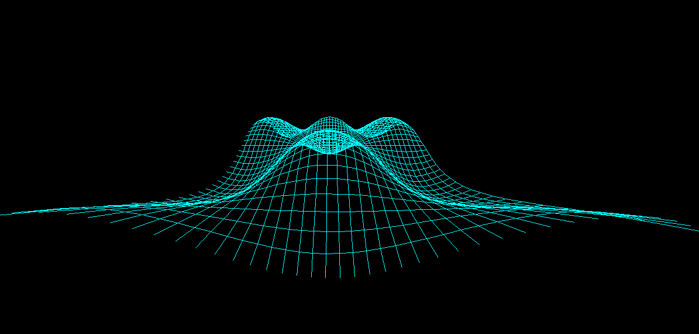
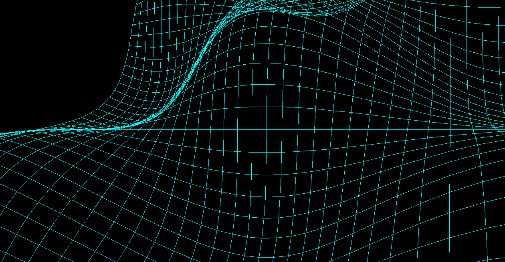

# 3D Multivariable Function Visualization Engine

---

## How 3D engine

This project is a custom-built 3D visualization engine designed to render and explore multivariable functions in real time. The system allows users to intuitively understand how mathematical surfaces behave in three-dimensional space by enabling rotation, scaling.

## 1. Function Representation

Multivariable functions of the form: z = f(x, y)
are sampled over a defined grid of `(x, y)` values. Each point is evaluated to produce a corresponding height `z`, forming a surface in 3D space.
---

### 2. Projection System

Since screens are inherently 2D, the 3D coordinates must be projected onto a 2D plane.

This engine uses a **projection rule** based on a simplified perspective transformation:

- Each 3D point `(x, y, z)` is transformed into a 2D coordinate `(x', y')`
- Depth (`z`) influences the final position to simulate perspective
- Objects farther away appear smaller, preserving depth perception

- x = dx/z & y = dy/z

This creates the illusion of a 3D environment on a flat display.
---

### 3. Rotation in 3D Space

The system supports interactive rotation around multiple axes:

- Rotation around X-axis (tilting up/down)
- Rotation around Y-axis (spinning left/right)
- Rotation around Z-axis (optional roll)

Rotation is applied using standard 3D rotation matrices before projection, allowing full spatial exploration of the function surface.
---

## Visualization Output

Below is an example of a rendered multivariable function surface:

---
---

## Zoomed Visualization

Below is an example of the same function under zoomed-in conditions:

---
